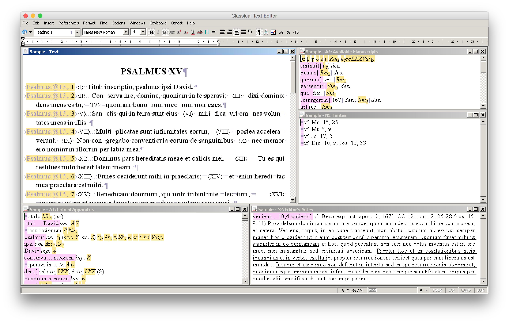

[Classical Text Editor](http://cte.oeaw.ac.at) can be used on Mac or Linux systems using a software package called [Wine](http://www.winehq.org) that attempts to duplicate the software necessary to run Windows programs. The result is not perfect, but allows for most day-to-day tasks. The following [limitations](http://appdb.winehq.org/objectManager.php?sClass=version&iId=29712) are currently known:

- Copy and paste operations do not work.
- Find and replace operations take more time than under Windows.
- Paper size is not passed on to the printer.
- OpenType fonts are invisible when printing.
- The program's built-in PDF creation is broken.
- Font rendering is inferior to that of ClearType under Windows.

The alternative to Wine is running Classical Text Editor under a virtualized copy of Windows (i.e. through [VMWare](http://www.vmware.com/fusion/), or [Parallels](http://www.parallels.com/desktop/), or [VirtualBox](https://www.virtualbox.org)). This, however, requires a licence for Windows (and the virtualization software if a commercial product is used). Wine is funded through donations, can be installed and removed very quickly, and is also somewhat faster than running a full copy of Windows.

These instructions focus on installing Classical Text Editor under the most recent version of Mac OS X and using a packaged version of Wine called WineBottler. (I have also tested Classical Text Editor under CrossOver, a commercial version of Wine; as of early 2014, it has an issue resulting in very poor test rendering, and I did not pursue it further.)

1. Download and install the [development version of WineBottler](http://winebottler.kronenberg.org). The development version of Wine is more cutting-edge than the stable version, which has been more thoroughly tested. Version 1.7.10, however, gave me fewer issues than 1.6.1.

2. Download the current [demo version of Classical Text Editor](http://cte.oeaw.ac.at/?id0=download).

3. Open WineBottler, and go the Advanced section. Change the following options:
    - Select the `cte32demo12.exe` file you downloaded as the program to install.
	- In the Wineticks section, type `uniscribe` into the search field, and check the box beside `Uniscribe 1.325`.
	- Change the bundle identifier to `at.ac.oeaw.cte` (deleting the existing `yourcompany` identifier).

	

4. Clicking the Install button will launch the CTE installer and walk you through the standard Windows installer; you can use the default settings. You will find it installed in your Applications folder.

5. Download a [newer copy of Uniscribe](http://homepage.univie.ac.at/stefan.hagel/cte/usp10.dll), which is necessary for OpenType support. Copy this file into your copy of CTE by choosing the 'Go to Folder' option in the Finder's Go menu, and typing `~/Library/Application Support/`. In the resulting window, look for a folder beginning with 'at.ac.oeaw.cte'; inside this folder, open `drive_c`, `Program Files`, and finally `Classical Text Editor`. Copy the `usp10.dll` file that you downloaded into this folder.

6. You can now open Classical Text Editor, and have a working demo. If you have a licence for the program, you can register your copy by going to the 'Upgrade to Full Version' option in the Help menu, which will download a file called `cte32upd12.exe`. Right-click (or control-click) on the file, go to the 'Open With' menu, and choose Wine. In the resulting dialogue box, choose to run the file directly (choosing the 'at.ac.oeaw.cte' option if it is not already selected). The updater will run, following which you can follow the instructions provided by Stefan Hagel to register the program. You may be prompted to enter a user and company name, which needs to match the name provided for the licence (both can also be left blank); if you find that you have made a mistake with either of these, you can change the registered name by opening the Wine application, going to the wineglass icon that appears in your menu bar, and opening the Configuration option. The owner and organization are changed in the 'About' tab.

7. (optional) If you wish to be able to create PDFs from the program, within the limitations listed above, this is possible by installing [PDFwriter](http://pdfwriterformac.sourceforge.net). Note that the operation of this program is slightly unusual; be sure to read its documentation.